# Auditoria de Logs

### Preparando o ambiente

Será necessário para realizar este curso o vagrant, o ansible, o git e o virtual box.

Lembre-se de clonar este repositório com as máquinas que seram utilizadas no curso:

### Importancia dos logs
A norma NBR ISO/IEC 27002:2013
fala-se sobre detectar e registrar atividades não autorizadas. Assim, é prioridade adotar uma
política de segurança.

> NBR ISO/IEC 27002:2013
12.4 Registros e monitoramento
Objetivo: Registrar eventos e gerar evidências.
12.4.1 Registros de eventos
Controle
Convém que registros (log) de eventos das atividades do usuário, exceções, falhas e eventos de
segurança da informação sejam produzidos, mantidos e analisados criticamente, a intervalos regulares.
Diretrizes para implementação
Convém que os registros (log) de eventos incluam, quando relevante:
 a) identificação dos usuários (ID);
 b) atividades do sistema;
 c) datas, horários e detalhes de eventos-chave, como, por exemplo, horário de entrada (log-on)
e saída (log-off) no sistema;
 d) identidade do dispositivo ou sua localização, quando possível, e o identificador do sistema;
 e) registros das tentativas de acesso ao sistema, aceitas e rejeitadas;
 f) registros das tentativas de acesso a outros recursos e dados, aceitas e rejeitadas;
 g) alterações na configuração do sistema;
 h) uso de privilégios;
 i) uso de aplicações e utilitários do sistema;
 j) arquivos acessados e o tipo de acesso;
 k) endereços e protocolos de rede;
 l) alarmes provocados pelo sistema de controle de acesso;
 m) ativação e desativação dos sistemas de proteção, como sistemas de antivírus e sistemas de
detecção de intrusos;
 n) registros de transações executadas pelos usuários nas aplicações.
Os registros de eventos estabelecem o fundamento para os sistemas de monitoramento automáticos,
os quais são capazes de gerar relatórios consolidados e alertas na segurança do sistema.
Informações adicionais
Os registros (log) de eventos podem conter dados confidenciais e informação de identificação pessoal.
Convém que medidas apropriadas de proteção de privacidade sejam tomadas (ver 18.1.4).
Quando possível, convém que os administradores de sistemas não tenham permissão de exclusão ou
desativação dos registros (log) de suas próprias atividades (ver 12.4.3).

## Introdução ao sistema de Logs

Atualmente, o Linux possui três diferentes serviços para a administração de logs, os quais
seguem a mesma linha. 

São eles: **syslog (o mais antigo), syslog-ng e rsyslog.**

##### Níveis de Criticidade
- Emerg , Alert, Critical. = indicam realmente um problema no serviço.
- Notice, Warn, Info, Debug = são considerados criticidades menores, mas não diretamente um problema.

##### Padrões de funcionalidades do syslog
- lastlog = contém informações dos últimos logins de usuários;
- dmesg = contém mensagens de reconhecimento de hardware pelo kernel;.
- messages =  é o principal log do sistema, possui mensagens enviadas por aplicações e serviços;
- syslog  =  arquivo padrão do sistema para qualquer evento que não possua um arquivo
específico, contendo uma diversidade.

## Conectando as máquinas

Primeiro localize as VMs, disponiveis no material, pelo terminal, com o comando:

```bash
vagrant up
```

As máquinas listadas faram conexão com o virtual box, e inicializaram os sistemas. Isso pode demorar um pouco no windows.

Para saber o ip de cada máquina, basta utilizar o comando :

```bash
cat enviroment.yaml
```

>- name: webserver-audit
  hostname: webserver
  ipaddress: 192.168.56.11
- name: graylog-audit
  hostname: graylog
  ipaddress: 192.168.56.12
- name: kibana-audit
  hostname: kibana
  ipaddress: 192.168.56.13

>senha:4linux

Para se conectar a uma das máquinas, use o comando:

```bash
ssh suporte@192.168.56.(final da maquina que deseja conectar)
```
## Localização Padrão dos arquivos de Logs.

Neste curso estam sendo utilizados os sistemas operacionais, debian, sent.os e ubuntu.

Depois de conectado ao servidor webserver execute o comando que irá listar os arquivos log por padrão do sistema.

```bash
ls -la /var/log/
```

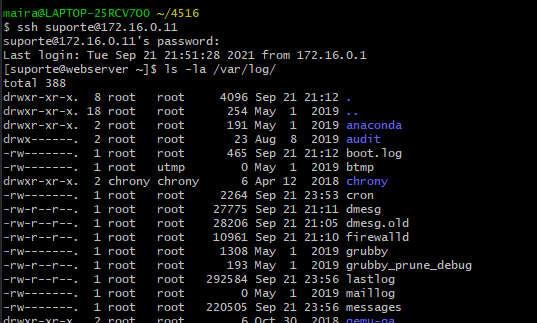

Por padrão todos os logs deste servidor estão salvos neste caminho **/var/log/**, que contém muitos arquivos de registros, incluse os citados no começo deste arquivo.

Utilize o comando last: exibe o conteúdo do arquivo /var/log/wtmp, exibe informações
referentes a login e logout de usuários do sistema.

```bash
sudo tail /var/log/lastlog
```


## Gerenciar Rotação de Logs

Com o aumento gradativo dos logs, podemos ter alguns problemas. Um deles é o tamanho de
um arquivo de log, o espaço em disco utilizado por estes arquivos.
Uma solução simples e padrão do sistema é o **logrotate**, realizando a quebra de logs por
tamanho ou tempo, além da possibilidade de compressão do arquivo, diminuindo o espaço em
disco utilizado.

### Log rotate
Solução para gerenciar e organizar os logs do sistema.

- weekly: define a rotação de logs semanais.
- rotate: mantém os últimos 4 arquivos de logs.
- create: cria arquivos .old após o rotate.
- compress: realiza a compressão gz nos arquivos de logs

Agora crie um arquivo de configuração personalizado com o cron. Serviço responsavel por listar informações sobre os logins.

No servidor graylog, utilize o comando para criar um novo arquivo.

```bash
sudo vim /etc/logrotate.d/cron
```
> adicione a ele o caminho :
cron. /var/log/cron.log {
 daily
 rotate 4
 compress
 delaycompress
 size 1M
 missingok
 notifempty
 create 644 root root
 }

- daily: define a rotação de logs diários.
- rotate: mantém os últimos 4 arquivos de logs.
- compress: realiza a compressão gz nos arquivos de logs.
- delaycompress: comprime o arquivo de log rotacionado apenas no próximo rotacionamento.
- size 1M: define para 1M o tamanho que o arquivo de log deve ter para ser rotacionado.
- missingok: se o arquivo de log não existir o logrotate não gera mensagens de erro.
- notifempty: não rotaciona o arquivo de log se o mesmo estiver vazio.
- create 644 root root: cria novos arquivo com permissão 644 onde o dono é o root
e grupo dono também é o root.


Para não conflitar com nossa configuração, edite o arquivo /etc/logrotate.d/rsyslog e comente a linha referente ao cron:

```bash
#/var/log/cron.log
```

Reinicie o serviço com o comando:

```bash
sudo systemctl restart rsyslog
```
Agora para verificar se deu certo.
Procure na pasta /var/log/ pelo arquivo facilitador cron, para exibir o conteudo use o comando a seguir.

```bash
sudo cat /var/log/cron.log
```
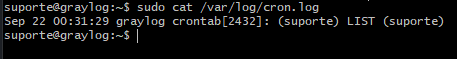


## Instalação e configuração do Auditd

Instalação e configuração do serviço auditd que vai gerenciar logs do sistema, através de regras.  

Conectado ao servidor graylog, instale o auditd com o seguinte comando:
```bash
sudo apt install auditd -y
```

Teste a ferramenta com o comando :
```bash
sudo auditctl --help
```

Para verificar o status do ambiente, use o parâmentro -s:
```bash
sudo auditctl -s
```


Para listar regras de auditoria, use o parâmetro -l:
```bash
sudo auditctl -l
```


##### Criando regras

Crie uma regra que auditora o arquivo **/etc/passwd**.

Para criar uma regra use os parâmetros -w e -p :
```bash
sudo auditctl -w /etc/passwd -p rwxa
```

Verifique se a regra foi criada:
```bash
sudo auditctl -l
```
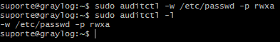

- **-w /etc/passwd**: inicia um observador (watcher) no arquivo passwd. Quando o
arquivo for acessado, o watcher irá gerar eventos.
- **-p rwra**: define o tipo de permissão a ser observado. A opção rwxa acrescenta leitura(r),
gravação(w),  execução(x) e alteração de atributos(a).


Pesquise com o comando a seguir, para verificar se deu certo.
```bash
sudo grep -i passwd /var/log/audit/audit.log
```

Se quiser excluir uma regra de auditoria, utilize o parâmentro -W :

```bash
sudo auditctl -W /etc/passwd
```

## Criação de regra para execução de Syscalls
O Syscall (chamada do sistema) é uma interface entre uma aplicação e o kernel do linux. Utilizando o audit é possivel gerar eventos relacionados as syscall criadas.

Ainda no servidor graylog, vamos criar uma nova regra para auditar mudanças no horário do sistema.
```bash
sudo auditctl -a exit,always -F arch=b64 -S clock_settime -F key=mudarhora
```

- **a always,exit**: permite adicionar uma regra. A opção always marca o tempo e grava
o registro. A opção exit permite criar um evento, quando a chamada do sistema for
encerrada.
- **-F arch=b64**: define um filtro para chamadas de arquitetura 64 bits.
- **-S clock_settime**: define uma chamada do sistema para registrar eventos, relacionados
ao relogio do sistema. Para ter acesso a lista completas de todas as chamadas de sistema,
acesse a man page do syscalls [1].
- **-F key=mudarhora**: define uma string para identificar a regra.

Mais informações sobre chamadas com o syscall.
```html
https://man7.org/linux/man-pages/man2/syscall.2.html
```

## Analise de eventos com Ausearch e Aureport.

Logue no servidor graylog.

Execute o comando para acesso root.
```bash
sudo su -
```
Utilize o comando a seguir com o parametro -l para saber quais regras estão ativas.
```bash
audictl -l
```

Crie a regra
```bash
auditctl -w /etc/passwd -p rwxa -k listadeusuarios
```
Crie a regra
```bash
auditctl -a exit,always -F arch=b64 -S clock_settime -k mudarhora
```

Agora altere a hora com o comando:
```bash
date --set "2020/08/21 20:00"
```
Para filtrar os eventos com o ausearch use o parametro -k e onde ele deve verificar:
```bash
ausearch -k listadeusuarios
```

Teste o comando crontab
```bash
crontab -l
```
Depois use o comando ausearch para pesquisar sobre os arquivos crontab
```bash
ausearch -x /usr/bin/crontab
```

Use o comando aureport para saber informações do sistema:
```bash
aureport --sumary
```

Conforme a imagem, ele irá listar organizadamente um relatório do sistema.
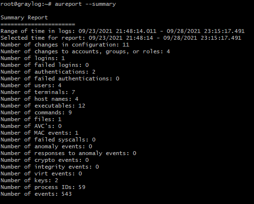

Agora se voce deseja ver todas as ocorrências do sistema, use o parametro -f desta forma:
```bash
aureport -f | tail
```
Conforme a imagem.


Para verificar registro de usuario use o comando com o parametro -m:
```bash
aureport -m
```
conforme a imagem se atente a linha amarela, eu adicionei o meu usuario:
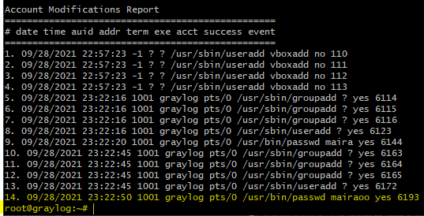

## Auditoria em tempo real.

O Linux **PAM** (Pluggable Authentication Modules) é um método altamente flexível para implementar serviços de autenticação em aplicativos e vários serviços de sistema.
A ferramenta auditd usa o módulo PAM **pam_tty_audit** para habilitar ou desabilitar a
auditoria de entrada TTY para usuários específicos. Depois que um usuário é configurado
para ser auditado, pam_tty_audit funciona em conjunto com o auditd para rastrear as
ações do usuário no terminal e, se configurado, captura as teclas exatas que o usuário faz e,
em seguida, registra no arquivo **/var/log/audit/audit**.

>O pluggin PAM não precisa ser instalado ele já vem com o audit. Que já foi instalado posteriormente.

Para visualizar os arquivos PAM, use o comando:
```bash
ls /etc/pam.d
```
Para realizar uma auditoria nos arquivos log,  é necessario editar o arquivo **common-password** que esta na pasta de arquivos pam.d

```bash
vi /etc/pam.d/common-password
```

Descomente a ultima linha do arquivo e adicione o texto:

```bash
session required pam_tty_audit.so disable=* enable=root log_passwd
```

> Esta linha ficará responsavel por gravar no arquivo de logs audit.log todos os comandos que o root executar.


Ainda precisa realizar mais uma ação que é informar ao audit qual seram as regras para auditar comandos executados pelo root.

```bash
echo '-a exit,always -F arch=b64 -F euid=0 -S execve' >> /etc/
audit/rules.d/audit.rules

echo '-a exit,always -F arch=b32 -F euid=0 -S execve' >> /etc/
audit/rules.d/audit.rules
```

reinicie o serviço auditd para aplicar as alterações realizadas
```bash
service auditd restart
```

Execute o comando para testar e aparecer nos registros log do root.
```bash
ls /opt
```

Agora verifique no arquivo **/var/log/audit/audit.log** com o comando grep os registros dos comantos executados pelo root no sistema.
```bash
grep '/opt' /var/log/audit/audit.log
```
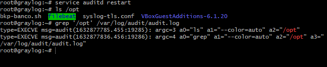

##### audispd-plugins

O pacote audispd-plugins fornece extensões para a interface em tempo real do sistema
de auditoria, audispd. Estas extensões podem fazer coisas como retransmitir eventos para
máquinas remotas ou analisar eventos em busca de comportamentos suspeitos.

Retransmissão de log, um plugin que permite interface em tempo real.

>Este plugin será necessário instalar.

Use o comando para instalar o plugin **audispd**.

```bash
apt-install audispd-plugins -y
```

Depois edite o arquivo **/etc/audisp/plugins.d/syslog.conf** com o comando :

```bash
vi /etc/audisp/plugins.d/syslog.conf
```

> altere a linha active para yes, e a linha args =  para LOG_LOCAL6

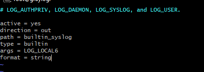

Depois descomente as linhas do arquivo **/etc/rsyslog.d/50-default.conf**
com o comando:

```bash
vim /etc/rsyslog.d/50-default.conf
```
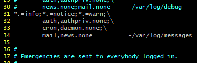

Reinicie os serviços com os comandos:
```bash
systemctl restart rsyslog

systemctl restart auditd
```

Irá verificar que o comando executado pelo root, irá aparecer no log do arquivo /var/log/audit/audit.


## Gerenciar logs remotamente.

Competências deste conteúdo
- Configurar servidor de logs remoto
- Logs remotos utilizando a criptografia TLS
- Configuração de armazenamento de logs
- Planejamento de capacidade e backup
- Armazenando logs no MySQL
- Planejamento de capacidade e backup do mysql

É importante centralizar os logs, devido a backup, serviços e formas únicas de identificar o servidor.

##### Criando um servidor de logs no Linux.

Acesse o servidor graylog-audit.


 Logue como root usando o comando:
 ```bash
 sudo su -
 ```

 Depois edite o arquivo **/etc/rsyslog.conf**, usando o comando:
 ```bash
 vi /etc/rsyslog.conf
 ```

 > Descomente as linhas responsaveis pelo protocolo 514 imudp e imtcp.

 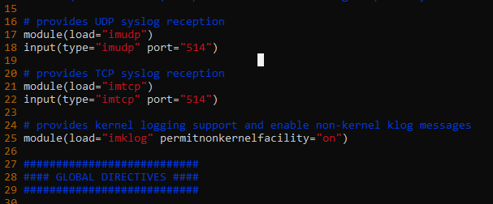


reinicie o serviço com o comando:
```bash
systemctl restart rsyslog
```

 Agora com o comando a seguir, verifique o ip do seu servidor de logs.
 ```bash
 ip -a
 ```
 Conforme a imagem :
 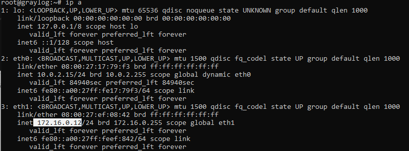

 E com o este comando você pode verificar se o **Rsyslog** esta recebendo requisições na porta 514/TPC. o comando ss é de netstat - listening
 ```bash
 ss -nlptu | grep 514
 ```
 Conforme a imagem a seguir:
 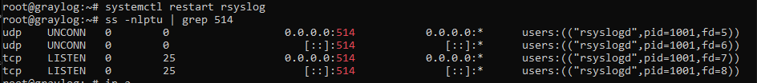

##### Configurando um template para separar os logs das máquinas.


 Crie um arquivo **template.conf** no diretorio **/etc/rsyslog.d** com o comando :

 ```bash
 vi /etc/rsyslog.d/template.conf
 ```
>Adicione ao arquivo o texto: template (name="LogRemoto" type="string" string="/srv/log/%HOSTNAME%/%PROGRAMNAME%.log")
*.* ?LogRemoto

• %HOSTNAME%: mostra o nome do host que enviou o log;
• %PROGRAMNAME%: mostra o nome do programa do log;
• %SYSLOGFACILITY%: envia a facilidade do log;
• %SYSLOGTAG%: mostra a tag da mensagem.

Conforme a imagem:
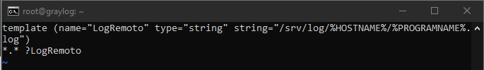

Crie o diretorio que foi citado no arquivo à cima, com o comando:
```bash
mkdir /srv/log
```

Depois dê permissão ao arquivo para os usuarios, com o comando:
```bash
chown syslog:syslog -R /srv/log
```

Para aplicar as alterações realizadas, Reinicie o sistema com o comando:
```bash
systemctl restart rsyslog
```

E verifique o status do serviço **rsyslog**, com o comando:
```bash
systemctl status rsyslog
```
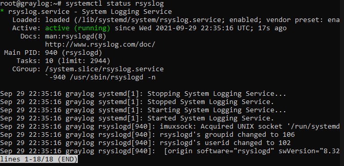

##### Preparando o cliente para enviar logs ao servidor criado.

Logue na máquina web-server em um terminal a parte.
Logue na máquina kibana-audit em outro terminal tambem.

Depois use o comando a seguir para criar o arquivo **etc/rsyslog.conf**, configurando o ENVIO de logs para o servidor graylog.
> Faça isso nas duas máquinas. O parametro +$ é para direciona-lo diretamente ao final do arquivo chamado.

```bash
sudo vi /etc/rsyslog.conf +$
```

>Dois arrobas para protocolo TCP, ou um arroba para protocolo UDP, seguido pelo nome do servidor, só fechar e salvar depois Conforme a imagem:

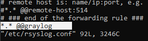


>nas duas máquinas

Depois é necessário reiniciar o serviço novamente, com o comando:
```bash
sudo systemctl restart rsyslog
```
>nas duas máquinas

##### Visualizando os logs recebidos dos clientes no servidor.

Agora retorne ao diretorio onde criou o servidor - graylog, e visualize que há uma pasta para cada cliente configurado para receber os logs.

Use o comando para listas as pastas, verifique que antes só tinha a do próprio servidor, e agora a mais duas :
```bash
ls /srv/log/
```
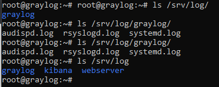


## Centralização de Logs com Graylog.

O graylog é um software para gerência de logs, Criado em 2009 por lennart, faz parte do conjunto de softwares do MongoDB e Elasticsearch, possibilitando a criação de filtros e aumentando a velocidade da pesquisa de mensagens.

Imagem ilustrativa do conjunto de softwares que vamos instalar.


Logado na máquina graylog obviamente com o comando:

```bash
ssh suporte@192.168.56.12
```

Atualize os pacotes com o comando:

```bash
sudo apt update
```

### Instalando o Java para o ElasticSearch.


Verifique se o java esta instalado com o comando.
> tem que estar em !
```bash
java -version
```

Instale o java com o comando:

```bash
sudo apt install default-jre
```
### Instalando o ElastichSearch
> O graylog não funciona com o ElastichSearch 7. Então instale o 6.
- Adicione a chave do repositório com o comando

```bash
curl -fsSL https://artifacts.elastic.co/GPG-KEY-elasticsearch | sudo apt-key add -

```
 
- Crie o arquivo de configuração do Elastic **elastic-7.x.list** e adicione os repositorios necessarios no arquivo.

```bash 
sudo vim /etc/apt/sources.list.d/elastic-7.x.list
```
Adicione ao arquivo
```
deb https://artifacts.elastic.co/packages/7.x/apt stable main
```

- Atualize os pacotes do sistema.
```bash
sudo apt-get update
```

- Instale o ElasticSearch com o comando

```bash
sudo apt-get install elasticsearch
```


- Edite o nome do cluster no arquivo **elasticsearch.yml** no diretorio elasticsearch com o comando:

```bash
sudo vi /etc/elasticsearch/elasticsearch.yml
```
Use o comando **:set number** para enumerar as linhas e ficar mais facil de localizar ok.

Na linha 17 apague o jogo da velha, para descomentar e por fim altere o nome para **graylog**, não esqueça de salvar. 

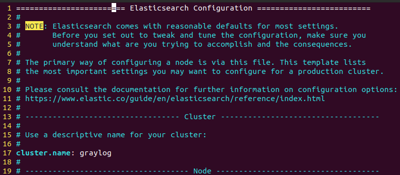


- Outro arquivo que precisamos editar é o **jvm.options** no mesmo diretorio elasticsearch. Use o comando.

```bash
sudo vim /etc/elasticsearch/jvm.options
```
Use o comando **:set number** para enumerar as linhas e ficar mais facil de localizar ok.

Nas linhas 22 e 23 altere de 1 giga para 512 megas.


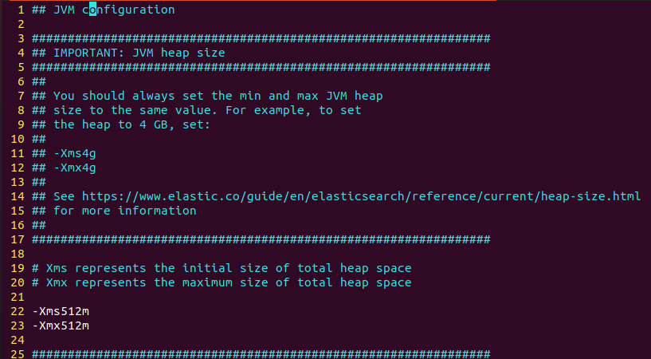


- Vamos configurar para ativar o serviço do elasticsearch sempre quando ligarmos a máquina

```bash
sudo systemctl enable elasticsearch.service
```

- Inicie o serviço com o comando:
```bash
sudo systemctl start elasticsearch.service
```
- Verifique o serviço com o comando:
```bash
sudo systemctl status elasticsearch.service
```

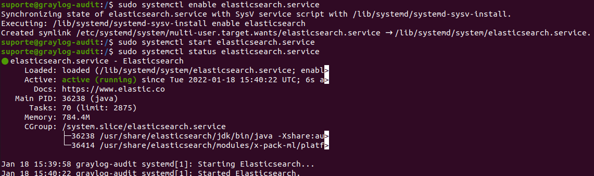


### Instalando o MongoDB.

- Adicone a chave do repositorio com o comando

```bash
sudo apt-key adv --keyserver hkp://keyserver.ubuntu.com:80 --
recv 9DA31620334BD75D9DCB49F368818C72E52529D4
```

- Crie um arquivo de configuração do MongoDB em **/etc/apt/sources.list.d/** o novo arquivo **mongodb-org-4.0.list** e adicione todos os repositorios necessarios para o MongoDB.

```bash
sudo vim /etc/apt/sources.list.d/mongodb-org-4.0.list
```

Adicone ao arquivo o código

```bash
deb [ arch=amd64 ] https://repo.mongodb.org/apt/ubuntu bionic/mongodb-org/4.0 multiverse
```

- Depois atualize os pacotes do sistema

```bash
sudo apt update
```
- E instale o MongoDB com o comando 
 
```bash
 sudo apt install mongodb-org -y
```

- Vamos configurar para ativar o serviço do mongo sempre quando ligarmos a máquina

```bash
sudo systemctl enable mongod.service
```

- Vamos iniciar o serviço
```bash
sudo systemctl start mongod.service
```

- Vamos verificar o status
```bash
sudo systemctl status mongod.service
```
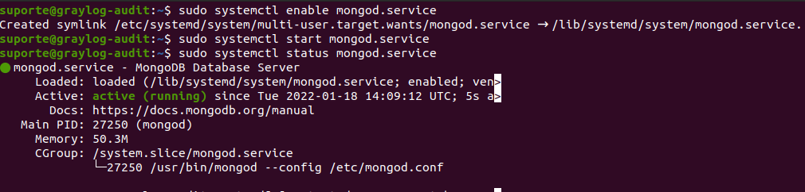

Se estiver com o mysql funcionando pode desativar, não vai usar mais e vai consumir mais processamento. 

### Instalação do graylog


Baixe o arquivo .deb do repositório com o comando:

```bash
sudo wget https://packages.graylog2.org/repo/packages/graylog-3.3-
repository_latest.deb
```
Descompacte a pasta com o comando
```bash 
sudo dpkg -i graylog-3.3-repository_latest.deb
```
Atualize os pacotes
```bash
sudo apt-get update
```

Instale o pacote **graylog-server** com o comando
```bash
sudo apt-get  install graylog-server -y
```


- Vamos configurar para ativar o serviço sempre quando ligarmos a máquina

```bash
sudo systemctl enable graylog-server.service
```

- Vamos iniciar o serviço
```bash
sudo systemctl start graylog-server.service
```

- Vamos verificar o status
```bash
sudo systemctl status graylog-server.service
```

Talvez de primeira o graylog não suba o serviço, isso porque pode demorar um pouco e tambem porque ainda há algumas configurações a finalizar.

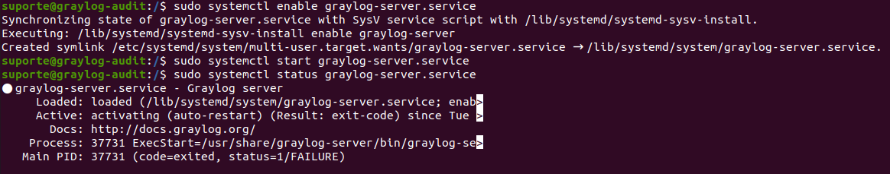

- Crie a senha para autenticação no Graylog Server com o comando
> Guarde a senha.

8yM7WtmKHjlUQEG6RSd1d5mhHHUx2xKKMtIJzuztjg0cDSsAF4yhP8OVw11gJTVbNxIvkpIA9iyasVgfyyPDpVzS8jZamcfG

```bash
sudo pwgen -N 1 -s 96
```
Gere a hash e salve com o comando

212e018e6377125c10c19d912a5bb537898ccd86d9e847131de1695330f69f7d  -
```bash
echo -n 4linux | sha256sum
```

- Localize o arquivo de configuração do Graylog em **/etc/graylog/server/server.conf** e altere os parametros que geramos nos comandos anteriores.

```bash
vim /etc/graylog/server/server.conf
```

Altere os seguintes valores
Parametro | Significado | Como preencher.
:-------: | :---------------------------: | :--------------------:
password_secret | Colar o resultado do comando pwgen -ŋN 1 -ŋs 96
root_password_sha2 |  Colar o resultado do comando echo -n 4linux
root_timezone | Horario | America/Sao_Paulo
http_bind_address | Interface de rede usada pela interface HTTP do Graylog.| IP da sua maquina
http_publish_uri | Usado para se comunicar com os outros nós do Graylog no cluster e por todos os clientes que usam a interface web do Graylog. | IP da sua maquina não tire o 9000
http_external_uri | Usado pela interface web do Graylog para se comunicar com a API REST do Graylog, interface da web do Graylog.| IP da sua maquina não tira o 9000


Em seguida reinicie o graylog-server

```bash
sudo systemctl restart graylog-server
```

Veja o status

```bash 
sudo systemctl status graylog-server
```
Agora funciona


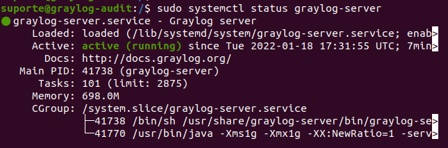


Faça o mesmo com o elasticsearch.

- reinicie o serviço com o comando:
```bash
sudo systemctl restart elasticsearch.service
```
- Verifique o serviço com o comando:
```bash
sudo systemctl status elasticsearch.service
```

Abra o ip que setou no arquivo do graylog no navegador com **:9000** no final que é a porta do serviço. 


Logue com as informações:

Usuario: admin
senha: 4linux

você vai visualizar este painel:
 
 
 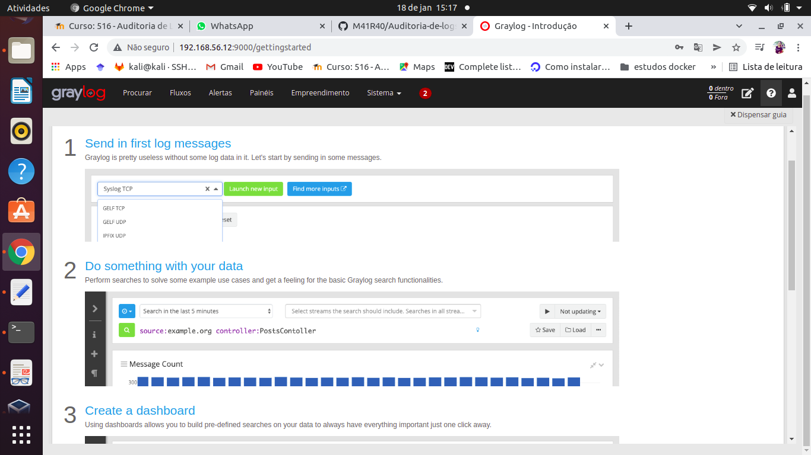
 
 
## Configurar e entender os Inputs.

Input é para aceitar a entrada de outro local para o graylog.

Vamos trabalhar com o input do syslog (UDP). 
Nos clientes vamos configurar para que todos os logs sejam direcionados para o Graylog. 


